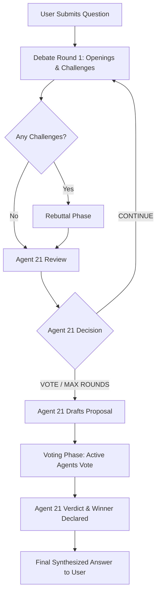

# 🎭 Agentic Debate Hub: Consensus Debate with Roster Resolver

[](https://fastapi.tiangolo.com/)
[](https://sqlite.org/)
[](https://ollama.com/)
[](https://deepmind.google/technologies/gemini/)

An interactive, multi-agent debate platform where AI personas with distinct backgrounds, temperaments, and worldviews discuss user-provided topics. Under the coordination of a dedicated chair agent (**Agent 21**), the participants challenge one another, address rebuttals, draft a joint proposal, vote to find a consensus, and ultimately synthesize a balanced, comprehensive answer for the user.

---

## ✨ Features

- **20 Unique Debater Personas**: A balanced roster of 10 male and 10 female agents, each defined by a specific background (e.g., ethicist, historian, venture capitalist, survivalist, diplomat) that dictates their stance, vocabulary, and debate style.
- **Autonomous Moderation & Steering (Agent 21)**: The Chair monitors the debate, filters out redundant arguments, has the authority to ban agents who violate debate decorum, and dynamically decides when to transition from argument rounds to a voting phase.
- **Challenging & Rebuttals**: Agents can call out other participants by name, triggering a targeted rebuttal phase where challenged agents defend their stance or counter-argue.
- **Consensus & Voting Logic**: Once arguments are fully explored, the Chair drafts a unified consensus proposal. Active debaters then vote (`AGREE` or `DISAGREE`). A final consensus is declared if the vote meets or exceeds the **60% threshold**.
- **Real-Time Streaming**: Full WebSocket-based integration showcases token-by-token streaming, speech transitions, bans, challenges, and voting tallies live.
- **Premium Glassmorphic UI**: A modern, high-fidelity dark interface designed with fluid animations, glowing states, agent-specific avatar designs, and visual indicators for gender-coded worldviews and phase transitions.
- **Dual LLM Backends**: Supports local inference via **Ollama** (defaulting to `gemma3:4b`) or cloud scaling via **Gemini API** (`gemini-2.5-flash-lite`).
- **Database Persistence**: SQLite integration stores all debate questions, posts, agent turns, and historical logs, letting users reload previous debates.

---

## 🛠️ Tech Stack

- **Backend**: Python, FastAPI, WebSockets, SQLite, `httpx`
- **Frontend**: Vanilla HTML5, CSS3 (Custom Variables, CSS Grid/Flexbox, Glassmorphism, animations), JavaScript (ES6+, WebSocket Client)
- **Libraries**: [Marked.js](https://marked.js.org/) (Markdown rendering), FontAwesome (Icons), Plus Jakarta Sans & JetBrains Mono (Google Fonts)

---

## 📐 Debate Lifecycle



---

## 👥 Meet the Debaters

The debate features 20 distinct personas with varied intellectual backgrounds:

| Name | Role / Persona | Tone / Style |
| :--- | :--- | :--- |
| **Marcus** | Retired Trial Lawyer | Airtight logic, legal precedent, dry, cutting. |
| **Diego** | Startup Founder | Tech optimist, allergic to doom, future-focused. |
| **Omar** | Ethics Professor | Calm, grounds arguments in moral philosophy. |
| **Finn** | Union Electrician | Plain-spoken, stubborn, suspicious of jargon/elites. |
| **Ravi** | Data Scientist | Statistics, base rates, suspicious of anecdotes. |
| **Maya** | Venture Capitalist | Coolly pragmatic, incentive-driven, second-order effects. |
| **Aisha** | Human-Rights Lawyer | Principles, dignity, defender of the vulnerable. |
| **Lena** | Behavioral Economist | Trade-offs, playful, evidence-driven. |
| **Nadia** | Futurist Technologist | Long-horizon consequences, emergent risk. |
| **Mei** | Measured Diplomat | Calm, looks for the workable middle ground. |
| *...and 10 more!* | *Poets, Historians, Journalists, Survivalists, and Engineers.* | |

---

## 🚀 Getting Started

### Prerequisites

- Python 3.9+
- [Ollama](https://ollama.com/) (if running locally) or a Gemini API key.

### Installation

1. **Clone the repository**:
   ```bash
   git clone https://github.com/ChetanyaRathi/multi-agent-debate.git
   cd multi-agent-debate
   ```

2. **Set up a virtual environment**:
   ```bash
   python3 -m venv venv
   source venv/bin/activate
   ```

3. **Install dependencies**:
   ```bash
   pip install -r debate-mvp/requirements.txt
   ```

### Configuration

The app defaults to local inference using **Ollama**.

#### Option A: Running Local LLM (Ollama)
1. Make sure Ollama is installed and running.
2. Pull the default model (or any model of your choice):
   ```bash
   ollama pull gemma3:4b
   ```
3. The server automatically connects to `http://localhost:11434` and uses `gemma3:4b`. You can override these in your environment:
   ```bash
   export OLLAMA_URL="http://localhost:11434"
   export MODEL="gemma3:4b"
   ```

#### Option B: Running Cloud LLM (Gemini API)
To use the Gemini API instead of Ollama:
1. Edit `debate-mvp/agent.py` to activate the Gemini block and export your key:
   ```bash
   export GEMINI_API_KEY="your-api-key-here"
   export MODEL="gemini-2.5-flash-lite"
   ```

### Running the Server

Start the FastAPI application using Uvicorn:

```bash
cd debate-mvp
uvicorn app:app --reload
```

Once running, navigate to **`http://localhost:8000`** in your web browser to start debating!

---

## 📁 Repository Structure

```
multi-agent-debate/
├── debate-mvp/
│   ├── app.py                # FastAPI Server, WS handling & Debate Loop
│   ├── agent.py              # LLM client prompting & streaming wrappers
│   ├── db.py                 # SQLite database models & query logic
│   ├── personas.py           # Debater persona configurations
│   ├── requirements.txt      # Python dependencies
│   ├── debate.db             # Local SQLite database (ignored by git)
│   └── static/
│       └── index.html        # HTML, CSS, JS single-page web app
├── .gitignore                # File exclusion patterns
└── README.md                 # Project documentation
```

---

## 🤝 Contributing

Contributions are welcome! Please open an issue or submit a pull request with any improvements, additions to the debater roster, or UI enhancements.

## 📄 License

This project is licensed under the MIT License.
